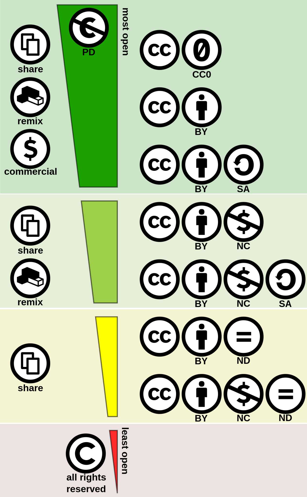

<!--
author:  jt
email:   

version:  0.0.1

@icon:

language: de

narrator: Deutsch Male

comment: Der digitale Baustein zu Digital Literacy  möchte Studierende  einen Überblick über künftige Schlüsselqualifikationen ermöglichen. Sie sollen verstehen, welche Kompetenzen künftige Berufs- und Arbeitsfelder erfordern und in der Lage sein, Digital Literacy in einem Lernprozess zu erfahren und zu beurteilen. Nach dieser Lerneinheit sollen Studierende  differenziert und reflektiert Tools und Software anwenden können.

 Den Studierenden sollen die Vorteile des kollaborativen Arbeitens als Teil der Digital Literacy näher gebracht werden. Hierbei steht insbesondere der Anbieter "cryptpad" im Fokus, dessen Funktionsweise anhand einzelner Foto- und Videosequenzen veranschaulicht wird. Am Ende dieses Abschnittes sollen die Studierenden die Vorzüge von digital-kollaborativen Arbeiten kennen und die grundsätzliche Bedienung des Tools cryptpad verstanden haben.

Ziel ist die Präsentation von Techniken und Instrumenten der digitalen
Literaturrecherche sowie Möglichkeiten der Literaturverwaltung.

Leitfaden zum Erstellen einer Formatvorlage in Word

base: https://cloudlab-olathub.rz.uni-kiel.de/user/stu205112/106513175450593/liascript-preview/
-->

# OER

<h3>Mehr als nur kopieren!</h3>

_feppa von [flickr](https://www.flickr.com/photos/feppa/4444555010)_

## Definition

|  |  |

> **Open Educational Resources** (kurz **OER**) sind freie Lern- und Lehrmaterialien, die mit einer offenen Lizenz (*Creative Commons* oder *GNU General Public Licenses*) veröffentlicht werden. **OER** ermöglichen eine neuen Weg Informationen zu erstellen und verteilen. Das Ziel von OER ist der freie und chancengleiche Zugang zu Bildung für alle. 

**OER umfassen**

* Lehrbücher
* Lehrpläne
* Lehrveranstaltungskonzepte
* Skripte
* Aufgaben
* Tests
* Projekte
* Audio-, Video- und Animationsformate.

Und vieles mehr...

## Rechtslage - Creative Commons

Bevor wir uns das Suchen und Finden von OER anschauen, wird im Folgenden ein kurzer Überblick über die Rechtslage der **Creative Commons** gegeben.

**Creative Commons** (abgekürzt **CC**) ist eine gemeinnützige Organisation. Sie veröffentlicht unterschiedliche Standard-Lizenzverträge, welche den Nutzenden vorschreiben, wie diese mit einem Werk umzugehen haben. Diese Lizenzen können auf alle möglichen Formate wie Texte, Bilder, Musikstücke, Videoclips usw. angewendet werden. 

>Die verschiedenen Lizenzen der Creative Commons unterscheiden sich erheblich. Einige CC-Lizenzen schränken die Nutzung relativ stark ein, andere wiederum sorgen dafür, dass auf das **Urheberrecht** so weit wie möglich verzichtet werden kann. Im folgenden wird die aktuelle Rechtslage kurz vorgestellt.

| Icon | Kürzel | Name | Erläuterung |
| -------- | -------- | -------- | -------- |
| | by  | Namensnennung    | Der Name des Urhebers muss genannt werden.    |
| | nc  | Nicht kommerziell (**N**on-**C**ommercial)   |Das Werk darf nicht für kommerzielle Zwecke verwendet werden.  |  
| | nd  | Keine Bearbeitung (**N**o **D**erivatives)  |Das Werk darf nicht verändert werden.  | 
| | sa  | Weitergabe unter gleichen Bedingungen (**S**hare **A**like)  | Das Werk muss nach Veränderungen unter der gleichen Lizenz weitergegeben werden.  |  

### Quiz Time Creative Commons

>Im folgenden könnt ihr eure Kenntnisse über die Creative Commons in einem Quiz überprüfen.

Dafür seht ihr eine CC Angabe in Form eines Bildes und müsst entsprechend die richtige Lösung finden.

[[x]] Diese Lizenz erfordert kein Copyright.
[[ ]] Diese Lizenz erdordert eine Namensnennung.
[[ ]] Diese Lizenz erfordert eine Namensnennung und eine Weitergabe unter gleichen Bedingungen.

[[ ]] Diese Lizenz erfordert eine Namensnennung und verbietet den kommerziellen Nutzen.
[[x]] Diese Lizenz erdordert eine Namensnennung.
[[ ]] Diese Lizenz erfordert eine Namensnennung, verbietet den kommerziellen Nutzen und verbietet jegliche Bearbeitung.

[[ ]] Diese Lizenz erfordert eine Namensnennung und verbietet die weitere Bearbeitung.
[[x]] Diese Lizenz erfordert eine Namensnennung und eine Weitergabe unter gleichen Bedingungen.
[[ ]] Diese Lizenz erfordert eine Namensnennung, verbietet den kommerziellen Nutzen und erfordert eine Weitergabe unter gleichen Bedingungen.

[[ ]] Diese Lizenz erfordert eine Namensnennung und verbietet den kommerziellen Nutzen.
[[x]] Diese Lizenz erfordert eine Namensnennung und verbietet die weitere Bearbeitung.
[[ ]] Diese Lizenz erfordert eine Namensnennung, verbietet den kommerziellen Nutzen und verbietet jegliche Bearbeitung.

[[ ]] Diese Lizenz erfordert eine Namensnennung, verbietet den kommerziellen Nutzen und verbietet jegliche Bearbeitung.
[[ ]] Diese Lizenz erfordert eine Namensnennung, verbietet den kommerziellen Nutzen und erfordert eine Weitergabe unter gleichen Bedingungen.
[[x]] Diese Lizenz erfordert eine Namensnennung und verbietet den kommerziellen Nutzen.

[[ ]] Diese Lizenz erfordert eine Namensnennung und eine Weitergabe unter gleichen Bedingungen.
[[x]] Diese Lizenz erfordert eine Namensnennung, verbietet den kommerziellen Nutzen und erfordert eine Weitergabe unter gleichen Bedingungen.
[[ ]] Diese Lizenz erfordert eine Namensnennung, verbietet den kommerziellen Nutzen und verbietet jegliche Bearbeitung.
    

    

[[x]] Diese Lizenz erfordert eine Namensnennung, verbietet den kommerziellen Nutzen und verbietet jegliche Bearbeitung.
[[ ]] Diese Lizenz erfordert eine Namensnennung und verbietet den kommerziellen Nutzen.
[[ ]] Diese Lizenz erfordert eine Namensnennung und verbietet die weitere Bearbeitung.

    
### Zusammenfassung der CC

Hier seht ihr nochmal alle aktuellen Lizenzen im Überblick!

## Drei Ausnahmen vom Urheberrecht

Zu den Ausnahmen des Urheberrechts gehören die sogenannten [Schranken des Urheberrechts](https://de.wikipedia.org/wiki/Schranken_des_Urheberrechts). Diese sollen einen Ausgleich zwischen dem Interesse der Urheber*innen und dem Interesse der Nutzenden einräumen. Im Kontext von OER werden dazu folgenden Ausnahmen erläutert:

* Die 15%-Regel aus § 60a für Unterricht und Lehre
* Zitatrecht
* Pastiche-Regelung

### Die 15%-Regel

Das [§ 60a UrhG](https://www.gesetze-im-internet.de/urhg/__60a.html) enthält diverse Ausnahmen für das Urheberrecht. Dadurch soll vor allem die Arbeit in der Wisschenschaft, Forschung, Lehre und Unterricht erleichtert werden. 

Nach  § 60a UrhG kann daher urheberrechtlich geschütztes Material bis zu einem Umfang von 15% für die "Veranschaulichung des Unterrichts und der Lehre an Bildungseinrichtungen" genutzt werden. Sowohl öffentliche als auch private Einrichtungen können von der Ausnahmeregelung Gebrauch machen, solange der zu Grunde liegende Unterricht nicht kommerziell vermarktet wird.

<h3> Was umfasst die 15%-Regel? </h3>

Es wird zwischen verschiedenen Mediengattungen unterschieden:

Vollständige Nutzung:

* Abbildungen & einzelne Beiträge aus einer Fach- oder wissenschaftlichen Zeitschrift

* vergriffene und sonstige sogenannte "Werke geringen Umfangs" wie z.B.

    + Druckwerke mit maximal 25 Seiten

    + Filme & Musik mit einer Spieldauer von maximal 5 Minuten

Nicht vollständige Nutzung (**15%-Regel**):

* Ausschnitte aus urheberrechtlich geschützten Schulbüchern, Fachbüchern, Romanen sowie "Kiosk-Zeitschriften" (Presse-Erzeugnisse wie Zeitungen und Magazine)

### Zitatrecht

In [§ 51 UrhG](https://www.gesetze-im-internet.de/urhg/__51.html) ist wohl die bekannteste rechtliche Nutzungserlaubnis. Beim wissenschaftlichen Arbeiten ist auf das Zitieren nicht zu verzichten. Vom rechtlichen Standpunkt aus versteht man unter Zitieren eine direkte Übernahme eines Ausschnitts eines fremden Werkes in die eigene Arbeit ohne Zahlung einer Nutzungsprämie.

<h3> Was muss man für ein urheberrechtlich einwandfreies Zitat berücksichtigen? </h3>

<h4>1. Zitatzweck </h4>

Ein Zitat ist nur dann zulässig, wenn es die eigenen Ausführungen wesentlich unterstützt oder der gesitigem Auseinandersetzung mit dem zitierten Werk dient. Dazu gilt, dass das eigen Werk eine eigene Schöpfungshöhe erreicht.

<h4> 2. Kennzeichnung und Quellenangabe </h4>

Das Zitat muss je nach Zitierstil grafisch oder durch Anführungszeichen gekennzeichnet sein. Das Zitat darf nicht verändert werden.

<h4> 3. Verhältnis zwischen eigenem Text & Zitat </h4>

Daumenregel: Die eigenen Ausführungen sollten quantitativ im Vordergund stehen und das Zitat sollte nicht als Ersatz zum Originalwerk in Konkurrenz treten.

### Pastiche-Regelung

Diese Regelung, festgehalten in [§ 51a UrhG](https://www.gesetze-im-internet.de/urhg/__51a.html), wurde 2021 eingeführt und ist sehr eng mit dem Zitatrecht verbunden. Sie gibt an, dass Material Dritter für kreative Art verarbeitet und dabei zu eigen gemacht werden kann. Bekannte Beispiele sind Remixes, Memes oder Fan Fiction.

Ein Pastich muss dabei als ein eigenständiges Werk zu erkennen sein und sich vom Original unterscheiden. Dies kann durch einen **inneren Abstand** (z.B. Parodie) oder einen **äußeren Abstand** (z.B. Abstraktion bei Fan Fiction) gemacht werden. Pastiche geben somit klar eine Fremdreferenz an.

### Quiz Time

Man darf einen 10-minütigen Filmausschnitt ohne Urheberrechtsangabe für ein eigenes Werk benutzen.

[[ ]] Wahr
[[x]] Falsch

Man darf mehrere Seiten aus einem geschützten Schulbuch einfach benutzen und vervielfältigen.

[[ ]] Wahr
[[x]] Falsch

Parodien sind Pastiche, da sie mit einem inneren Abstand dem Original gegenüberstehen und können ohne Verletzung des Urheberrechts veröffentlicht werden.

[[x]] Wahr
[[ ]] Falsch

Bei einem Zeitungsartikel darf man bis zu 15% des Gesamttextes für eigene Zwecke benutzen.

[[x]] Wahr
[[ ]] Falsch

## Suchen und Finden von OER

<h3>Ständig und dauerhaft im Wandel</h3>

**Im folgenden wird daher nur oberflächlich die Suche angeschnitten**

_jpellgen von [flickr](https://www.flickr.com/photos/jpellgen/3447170593)_

### 1. Über bekannte Suchmaschinen

<h3> Google </h3>

Bei der erweiterten Google Suche gibt es die Möglichkeit nach den zuvor vorgestellten Creative Commons zu filtern.

[Hier](https://www.google.de/advanced_search) gelangt ihr direkt zur erweiterten Google-Suche.

<h3> Youtube </h3>

Geeignetes Videomaterial lässt sich auch bei Youtube mit dem Creative Commons Filter finden.

#### Schritt-für-Schritt Anleitung zum Suchen eines Bildes zu "Suchen"

Gerade für Illustrationen werden viele Bilder verwendet. Oft werden dabei aber nicht die Urheberrechte beachtet. Im folgenden wird eine Schritt-für-Schritt Anleitung für die Google Bildersuche vorgestellt, welche die **Creative Commons** berücksichtigt.

1. Man gibt den gewünschten Begriff (hier: "Suchen") in das Suchfeld ein.

2. Man lässt sich die Ergebnisse als Bilder anzeigen und öffnet den Suchfilter.

3. Im Suchfilter geht man unter Nutzungsrechte auf die Creative-Commons-Lizenzen.

4. Alle Ergebnisse haben nun die entsprechenden CC-Lizenzen, die ja bereits am Anfang des Bausteines vorgestellt wurden. Es gilt zu beachten, dass alle CC-Lizenzen angegeben werden! Bei jedem Bild muss individuell geschaut werden, welche Lizenz dem Bild genau zu Grunde liegt. Es empfielt sich natürlich immer CC0, da man auf nichts weiteres achten muss.

Für dieses Beispiel konnte so das folgende Bild mit einer CC0 Lizenz gefunden werden:

### 2. Auf OER Seiten

Es gibt diverse Internetseiten, welche den Zugang zu OER ermöglichen. Da OER ein sehr aktuelles und schnell veränderdes Thema ist, liegt es an dem Leser dieses Bausteins die passenenden Angebote online zu finden.

## Erstellen eigener OER

1. Inhalte identifizieren: Wähle ein Thema oder einen Bereich, für den du Ressourcen erstellen möchtest, und sammle alle relevanten Materialien zusammen.

2. Inhalte planen: Überlege dir das Format und die Struktur deiner Ressourcen und erstelle einen Plan, wie du die Informationen organisieren und präsentieren möchtest.

3. Ressourcen erstellen: Verwende Werkzeuge wie Textverarbeitungsprogramme, Multimedia-Erstellungssoftware etc. um deine Ressourcen zu erstellen.

4. Ressourcen veröffentlichen und verteilen: Teile deine Ressourcen mit anderen, indem du sie auf OER-Plattformen veröffentlichst.

5. Ressourcen bewerben und evaluieren: Verbreite das Wort über deine Ressourcen und sammle Feedback von Benutzern, um deinen Inhalt ständig zu verbessern.

**Reminder: Beim Erstellen deiner OER ist es wichtig, Copyright und Lizenzierung zu berücksichtigen und so oft wie möglich offene Quellen oder CC-lizensierte Materialien zu verwenden.**

## Chancen & Probleme

|<h2>Chancen</h2>|<h2>Probleme</h2>|
|-------|--------|
|offene Bildung für alle|schlechte Aufklärung beim Urheberrecht|
|einfache Verbreitung|Qualitätssicherung|
|kostenfrei|Beständigkeit im Hinblick auf Finanzierung|

## Literatur & Quellen

Fischer, Georg:  Drei Ausnahmen vom Urheberrecht: 15%-Regel für Unterricht und Lehre – Zitat – Pastiche, in OERinfo, 2. November 2022, https://open-educational-resources.de/ausnahmen-vom-urheberrecht/ [letzter Zugriff am 01.03.2023].

El-Auwad, Maja: OER nutzen oder selbst erstellen: Wo man geeignete Materialien findet, in OERinfo, 29.04.2022, https://open-educational-resources.de/wo-man-offen-lizenzierte-materialien-findet/ [letzter Zugriff am 01.03.2023].

Grimm, Susanne: Bilder für Schulprojekte finden und nutzen – die OERPoster, in OERinfo, 23.11.2022, https://open-educational-resources.de/die-oerposter/ [letzter Zugriff am 01.03.2023].
fOErde, CAU & Leibniz-Institut für die Pädagogik der Naturwisschenschaften und Mathematik, https://oer.uni-kiel.de/ [letzter Zugriff am 01.03.2023].

Hylén, Jan. "Open educational resources: Opportunities and challenges." (2020).

